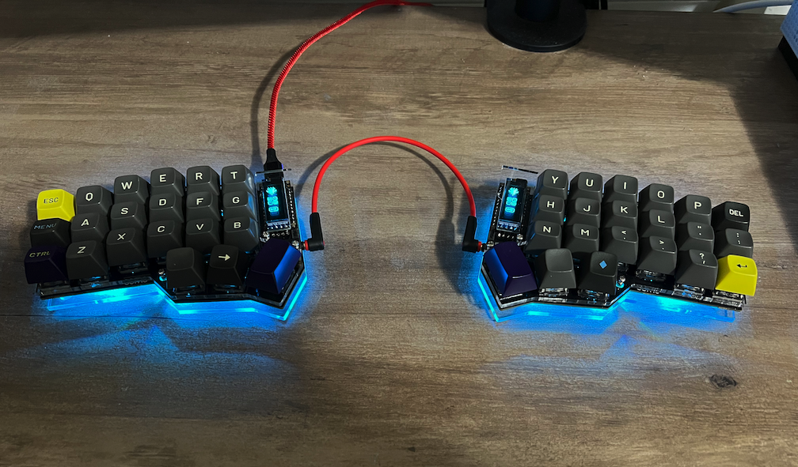
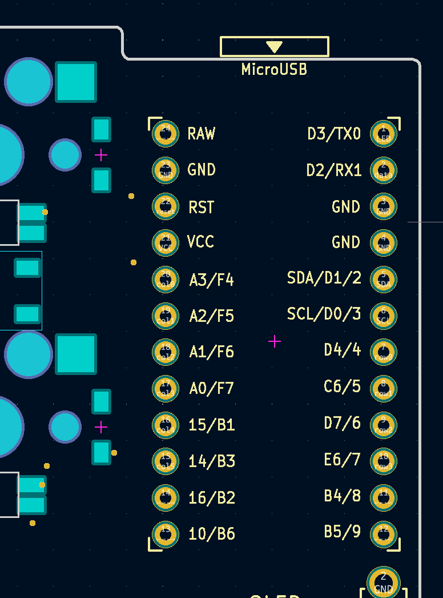
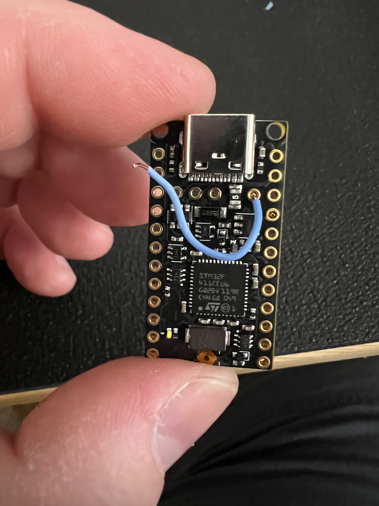
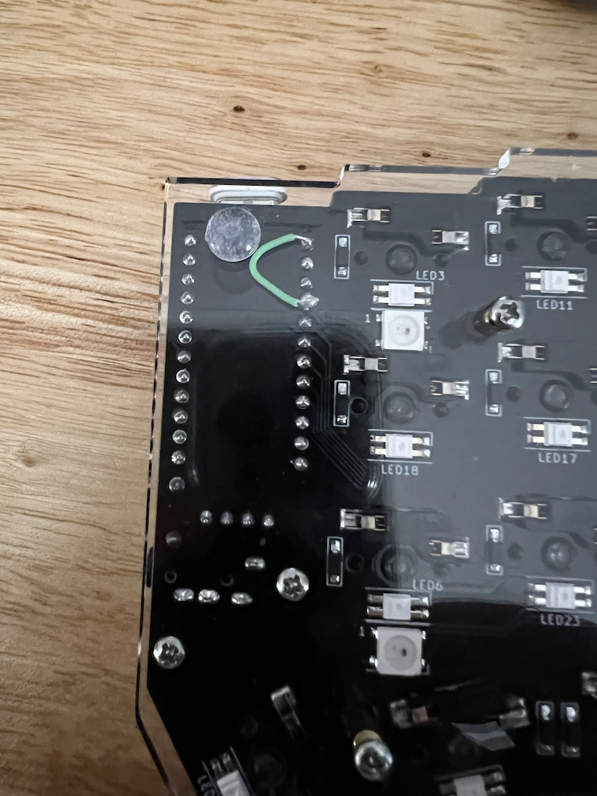
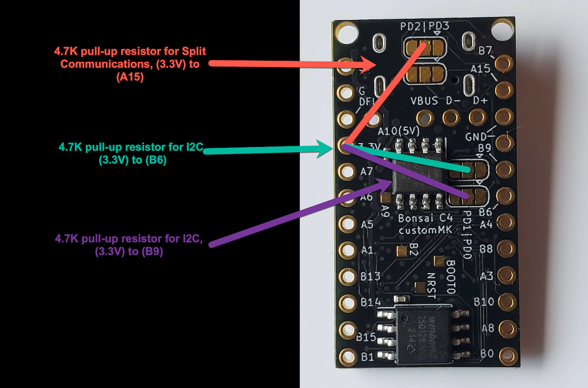
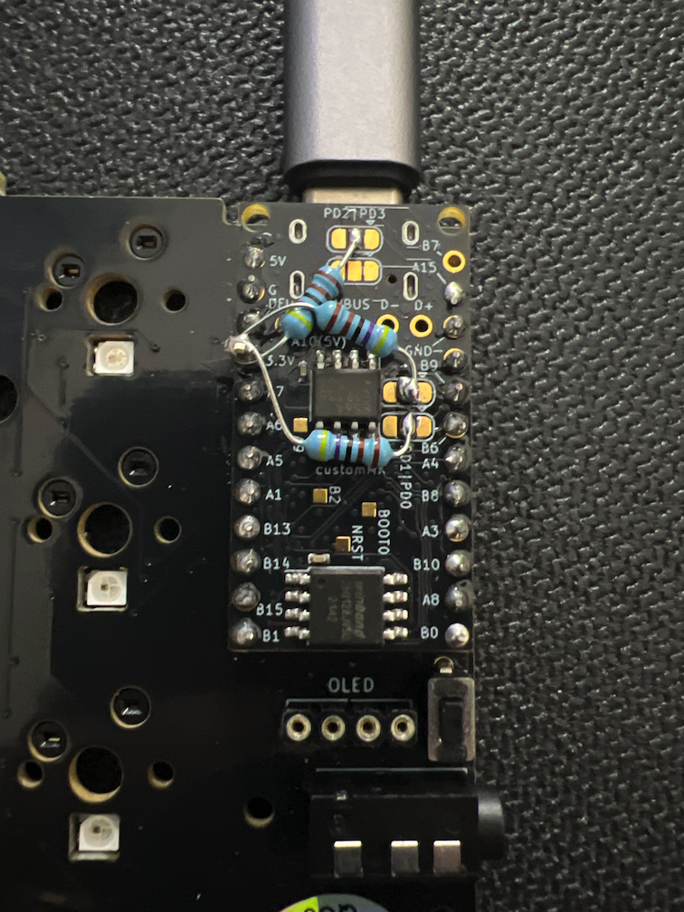

# Using Bonsai C4 on a CRKBD/Corne v3 PCB. 

<p align="center">
<a href="../images/corne.png"></a>
</p>

This guide will show you how to install a Bonsai C4 on a CRKBD v3 PCB. This has so far only been attempted on a Cherry MX version of the board, however it should be the same with the Choc version. The Bonsai C4 is an STM32F411 microcontroller designed by [customMK](https://shop.custommk.com) as a drop-in replacement for the Pro-Micro and it's clones. As QMK becomes more feature-rich and those features grow in complexity and size, so too do our flash memory requirements. The Bonsai C4 provides 512kB of program memory and 16MB of external flash storage, as opposed to the 28kB of QMK-usable storage on Pro-Micros, providing enough memory for all the QMK features you could hope for and hopefully making your board future-proof for some time to come.

Please note that, while I am confident you'll have no problems if you follow this guide closely, I take no responsibility for any damage your keyboard or components may suffer from attempting this installation. If you're unsure of how to do something, ask first.

## Requirements

### Tools Needed

- Soldering Iron
- Solder
- Flux (Not strictly necessary but can make soldering easier)
- Wire cutters/strippers

### Materials Needed

|Name|Qty|Notes|
|:-|:-|:-|
|Bonsai C4 Compact Edition|2|MCU can be found at [CustomMK](https://shop.custommk.com/products/bonsai-c4-microcontroller-board)|
|4.7Kohm Resistor<sup>[1](./c4conversion.md#Notes)</sup>|5|If not using OLED screens then only 1 resistor is required.|
|Wire|6|Used to "jumper" from one pin on MCU to another, I used wires from a Cat5e cable.|
|CRKBD v3 PCB|2||
|Taller OLED Standoffs|4|The added resistors can increase the controller's height and require modification OLED screens/covers, see [MCU Installation](./c4conversion.md#mcu-installation)|

# Building the CRKBD Keyboard
Because the C4 has differently named pins from the Pro-Micros and the CRKBD board usually uses Pro-Micro pin names, depending on your specific board, I will be using the following notation in an attempt to keep it straight. Pins on the Bonsai C4 will be in parentheses. Pins on the CRKBD board will be in square brackets. I'll also try to keep the language used non-ambiguous. All steps except the Split Communications step need to be performed on both halves of the keyboard.

- (Bonsai C4)
- [CRKBD Board]

If your board doesn't have pin names on the silkscreen you can find the names I used in the screenshot below. The v3 PCB orients the MCU footprint in such a way that it is oriented the same on both sides.

<p align="center">
<a href="../images/crkbd_pins.png"></a>
</p>

## RGB LED Data In Voltage

<p align="center">
<a href="../images/rgb_jumper.png"></a>
</p>

Most RGB LEDs, such as the WS2812 LEDs on the Keyhive Corne kit, require 5v on the data line<sup>[2](./c4conversion.md#Notes)</sup>. The corresponding pin on the C4 only supplies 3.3v, though, so you have to bring the correct voltage in from elsewhere on the C4. Pin (A10) supplies 5v so you'll need to solder a wire into the Bonsai (A10) pad and use it in the board's [D3] pad. I used an internal wire from a Cat5e cable because I could strip back just enough insulation for the solder joints but leave enough to ensure the cable didn't short out against something else. If you don't have any RGB LEDs on your board then you can skip this section, just leave both (A10) and (B7) unconnected.


## Board Power

<p align="center">
<a href="../images/5v_jumper.png"></a>
</p>

The CRKBD expects 5v on the board's [VCC] pad, however the corresponding Bonsai pin provides 3.3v. This means you need to bring 5v power from another location on the Bonsai C4, in this case the (5V) pin. Luckily the corresponding pad on the CRKBD board, the [RAW] pad, is unused so you can connect the Bonsai (5V) pin to the board's [RAW] pad and then underneath the board jumper from the board's [RAW] pad to the board's [VCC] pad. This results in fewer jumper wires between the Bonsai C4 and the board and makes assembly slighty easier. If you do this then the Bonsai's (3.3V) pin is left unconnected to the board.

## Split Communications

<p align="center">
<a href="../images/c4.png"></a>
</p>

To allow split communications to operate correctly you need to add a 4.7K pull-up resistor from the Bonsai's (3.3V) pin to the Bonsai's (A15) pin. This is only necessary on one half of the CRKBD, however documentation says you can add a resistor on both halves if you want. This is made easier by the solder jumper pads on the Bonsai C4. I soldered a pin into the Bonsai (3.3V) pad to give me a greater surface area to work with when soldering the resistors. Note that the pin is not connected to the CRKBD board. One side of the pull-up resistor is soldered onto this (3.3V) pin and the other side is on the solder jumper pad corresponding to (A15). The picture in the next section shows all resistors.

## OLED I2C Resistors

<p align="center">
<a href="../images/resistors.png"></a>
</p>

The OLED screens are controlled via I2C, regardless of whether I2C is enabled elsewhere in the firmware or not. For I2C to work on STM32-based controllers you have to have a 4.7Kohm pull-up resistor on both I2C lines on both controllers. This means soldering a resistor from the Bonsai's (3.3V) pin to the Bonsai's (B9) pin and another from (3.3V) to (B6). Again, you can solder to the jumper pads which affords easier access.

## MCU Installation
It may be easier to complete the resistor installation after the Bonsai C4 has been soldered/socketed to the CRKBD, but can be done in either order. Installation is no different than any other MCU, except that you won't have Bonsai pins (B7) or (3.3V) directly connected to the CRKBD board. 

Please note that the resistors soldered on top of the MCU adds a fair amount of height. On my board I had been using Pro-Micros with socketed OLED screens. After installing the C4 and resistors the legs on the OLED screens were no longer tall enough to sit on top of the controller and I had to de-solder the legs and install taller legs. I also had to have 12mm standoffs for the OLED covers instead of the standard 10mm that come with the KeyHive acrylic plates. It may be possible to install the resistors underneath the PCB by running (3.3V) to an unused pad, just like (A10) to [D3] for RGB data, thereby keeping a lower profile. This method of installation is untested and would require study of the [corne v3 PCB schematics](https://github.com/foostan/crkbd/tree/main/corne-cherry/pcb) and testing on your own. 

## Summary (TLDR)
To summarize, when finished you should have the following:
- A jumper wire from the Bonsai (A10) pin to the CRKBD's [D3] pad.
- Bonsai (5V) pin connected to the CRKBD's [RAW] pad and jumpered under the PCB from the CRKBD's [RAW] pad to the CRKBD's [VCC] pad.
- A 4.7K pull-up resistor from the Bonsai's (3.3V) pin to the Bonsai's (A15) pin on one MCU.
- If using OLED screens, then you should have soldered a 4.7K pull-up resistor from the Bonsai's (3.3V) pin to Bonsai's (B6) pin and another from (3.3V) to (B9), on both controllers.
- Soldered the Bonsai C4 into place on the board with the Bonsai (3.3V) pin not connected to the board, nor the (B7) pin directly connected to the board, unless your LED's are capable of utilizing 3.3v instead of 5v.

## QMK Firmware Preparation

Files to build firmware for Bonsai C4 are not currently included in the standard QMK repo. You will need to download the necessary files or fork my repository. If you decide to manually download the files, I suggest creating a branch for the Bonsai C4 as some changes did have to be made to crkbd.c and crkbd.h. 

### Required files for Bonsai C4
- [Bonsai C4 Board Files](https://github.com/mwpardue/qmk_firmware/tree/bonsai_c4/platforms/chibios/boards/BONSAI_C4)

### Required Files for CRKBD
- Entire [crkbd/c4](https://github.com/mwpardue/qmk_firmware/tree/bonsai_c4/keyboards/crkbd/c4) directory
- [halconf.h](https://github.com/mwpardue/qmk_firmware/blob/bonsai_c4/keyboards/crkbd/halconf.h)
- [mcuconf.h](https://github.com/mwpardue/qmk_firmware/blob/bonsai_c4/keyboards/crkbd/mcuconf.h)
- [post_rules.mk](https://github.com/mwpardue/qmk_firmware/blob/bonsai_c4/keyboards/crkbd/post_rules.mk)
- Edit [crkbd.c](https://github.com/mwpardue/qmk_firmware/blob/bonsai_c4/keyboards/crkbd/crkbd.c) and [crkbd.h](https://github.com/mwpardue/qmk_firmware/blob/bonsai_c4/keyboards/crkbd/crkbd.h). You can diff the master and bonsai_c4 branches to see exactly what was changed if needed. 

### Keymap Changes
- In the rules.mk in your keymap folder, ensure you don't have the following lines. You can simply comment them out if needed by adding a '#' sign in front.
    * `BOOTLOADER`
    * `MCU`
    * `BOARD`

Set `LTO_ENABLE = no`. I'm not sure this is strictly necessary, but I've read that link-time optimization can cause problems on Chibios boards. Besides, with a C4 there's no need to worry about the size of your firmware. :;):

## Make Instructions

To build the default keymap for a C4 Corne, assuming the same folder structure as my repo:

```
make crkbd/c4:default
```

To flash the default keymap for a C4 Corne, assuming the same folder structure as my repo:

```
make crkbd/c4:default:flash
```

# Troubleshooting
If you have completed installation of the Bonsai C4 and something isn't working, here are a few troubleshooting steps you can take.

## RGB Not Lighting Up Correctly
Ensure you've got good solder joints where your jumper wire is connected from (A10) to [D3]. If you have a multimeter you can test continuity from the (A10) pin to the underside of the board where you soldered [D3], either the socket or MCU, into the board. If you have good solder joints you should have continuity from one point to the other. Also search Google for 'cold solder joints' and make sure your joints don't appear dull, malformed, or incomplete. If unsure you can reflow the joint with your soldering iron or add a touch more solder. 

## Split Communications and/or OLED Not Working
If you're having trouble with the two halves of your keyboard not communicating or the OLED screen(s) not showing up properly then the most likely source of the trouble is the resistor(s). While the solder jumper pads make those pins much more easily accessible, it can also be easy to accidentally add too much solder and jumper the pads together. Look closely at the solder joint and make sure this hasn't happened to you. You can use a multimeter to determine if they are shorted or not by checking continuity between the left-most pad and the middle pad (oriented with the USB port at the top). If the left-most pad and center pad on any solder jumper have continuity then you have too much solder in the middle. You can remove some excess solder with a solder sucker or solder wick or other techniques available online. 

You'll also want to confirm the correct resistance from pin to pin. If you use your multimeter to check continuity from the (3.3V) pin to the destination pin ((A15), (B6), (B9)) then the resistance shown on the multimeter should equal the value of the resistor you used. Eg. a 4.7K resistor for split comms should show 4.7Kohms resistance from (3.3V) to (A15). If you get a different value, check your solder joints and if all else fails you might have a bad resistor.

# Help
If you have questions about this guide or have a unique situation and need some help, please feel free to reach out to me. I am Perrin on the customMK [Discord](https://discord.gg/mGTq3wRQdx) server, and the creator of the C4 is very helpful and responsive on Discord as well. The rest of the members on the Discord server are friendly and willing to help, too, so I'm sure you can find your answers there.

# Notes
<sup>1</sup>According to QMK [documentation](https://docs.qmk.fm/#/feature_split_keyboard?id=i2c-wiring) 4.7Kohm is ideal for I2C but as long as total resistance is within 2.2K-10Kohm it should work. 4.7K and 10K resistors have been tested and found working with Bonsai C4 at time of writing.

<sup>2</sup>If your board uses different LEDs and you are 100% certain they require 3.3v then you don't need to jumper from the Bonsai C4's (A10), instead you can use Bonsai's (B7). You will have to edit the crkbd/c4/config.h file from `define RGB_DI_PIN A10` to `B7`.
# Credits
None of this would be possible without the following:
- [QMK Firmware](https://github.com/qmk/qmk_firmware), and all the developers that have contributed to build it into the firmware we have today. 
- [foostan](https://github.com/foostan/crkbd/tree/main/corne-cherry/pcb), creator of the CRKBD keyboard
- [customMK](https://shop.custommk.com/products/bonsai-c4-microcontroller-board), designer and seller of the Bonsai C4.
- customMK's [Discord](https://discord.gg/mGTq3wRQdx) where the folks are extremely helpful and without whom I never would have figured out how to make the C4 work on the CRKBD. I might be writing the guide but customMK deserves all the credit.
